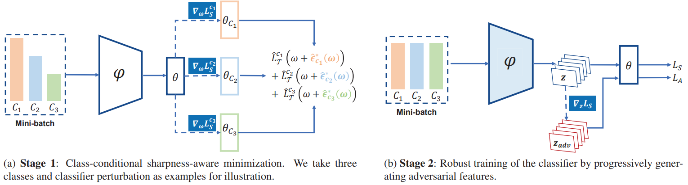

# Class-Conditional Sharpness Aware Minimization for Deep Long-Tailed Recognition
This is the implementation of our CVPR'23 paper "[Class-Conditional Sharpness-Aware Minimization for Deep Long-Tailed Recognition](https://openaccess.thecvf.com/content/CVPR2023/papers/Zhou_Class-Conditional_Sharpness-Aware_Minimization_for_Deep_Long-Tailed_Recognition_CVPR_2023_paper.pdf)". In this paper, we propose a new variant of SAM to better adapt to the scenario of deep long-tailed recognition.
<p align="center">

</p>

## Installation

**Requirements**
* python 3.6
* PyTorch 1.4.0
* torchvision 0.5.0
* opencv 4.2
* numpy 1.19.5

## Training
### CIFAR-10-LT
Specify the data path ("data_root") in configs/Cifar10.json. Then running the following commend:
```bash
$ python3 train_cifar.py --config ./configs/Cifar10.json
```

### CIFAR-100-LT
Specify the data path ("data_root") in configs/Cifar100.json. Then running the following commend:
```bash
$ python3 train_cifar.py --config ./configs/Cifar100.json
```

### Stronger Augmentation Usage
Uncomment the CIFAR10Policy and Cutout in datasets/Cifar.py:
```bash
self.transform = transforms.Compose([
                transforms.RandomCrop(32, padding=4),
                transforms.RandomHorizontalFlip(),
                CIFAR10Policy(),    # add AutoAug
                transforms.ToTensor(),
                Cutout(n_holes=1, length=16),
                transforms.Normalize((0.4914, 0.4822, 0.4465), (0.2023, 0.1994, 0.2010)),
            ])
```

## Citation
```
@inproceedings{zhou2023ccsam,
author = {Zhou, Zhipeng and Li, Lanqing and Zhao, Peilin and Heng, Pheng-Ann and Gong, Wei},
title = {Class-Conditional Sharpness Aware Minimization for Deep Long-Tailed Learning},
booktitle = {Proceedings of the IEEE/CVF Conference on Computer Vision and Pattern Recognition},
year = {2023}
}
```

## Correspondence
If you have any further questions, please feel free to contact Zhipeng Zhou by zzp1994@mail.ustc.edu.cn

